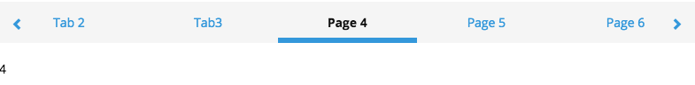
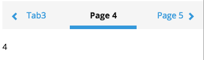
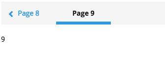
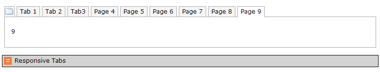

# Responsive Tabs 📱

Responsive, scroll/swipeable tabs

### Installation

1. Install the widget in your project
2. Include the **Responsive Tabs** widget on a page as a sibling of a tab container you'd like to display as full-width responsive
   

   ​
3. Configure the widget:

+ `breakpoint` : Screen width (in pixels) to split between the large number of items and the small number
+ `Large Number` : Number of tabs to show above the breakpoint
+ `Small Number` : Number of tabs to show below the breakpoint
+ `Tabs Class (To Add)` : Add a class to the bar of tab headings

### Typical usage scenario

- When you have a lot of tabs and don't want them to stack 🍔
- Works nicely with **[Swipeable Tabs](https://github.com/cdcharlebois/SwipeableTabs)** widget

### Known Limitations

- none

###### Based on the Mendix Widget Boilerplate

See [AppStoreWidgetBoilerplate](https://github.com/mendix/AppStoreWidgetBoilerplate/) for an example
